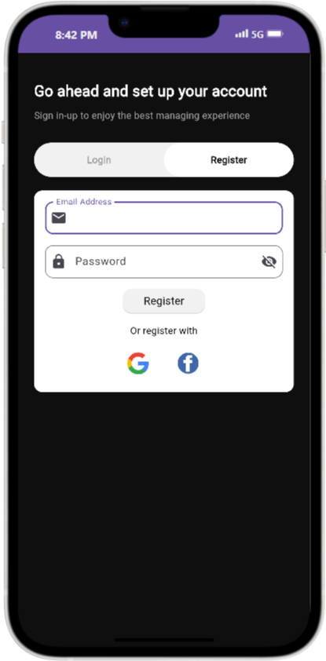
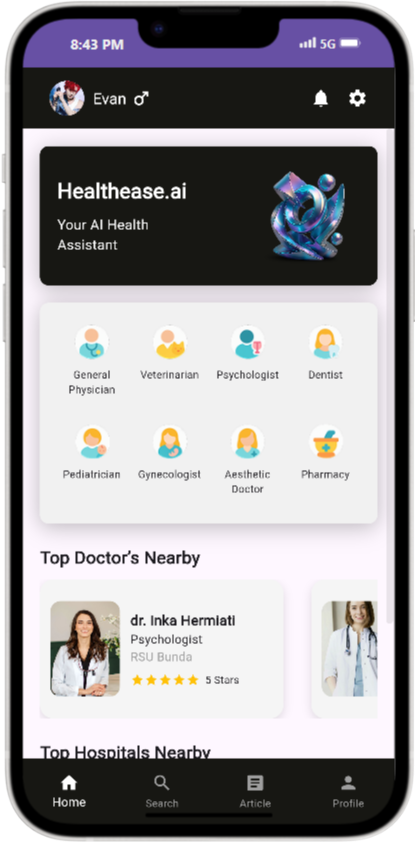

# 🩺 Healthease - Flutter + Firebase App

Healthease is a modern mobile app built with Flutter and Firebase. It offers a smooth healthcare experience with features like doctor appointment booking, patient management, and article sharing — all in one seamless UI.

---

## 🚀 Features

- 🔐 Firebase Authentication (Email & Google Login)
- 👨‍⚕️ Doctor listing (from Firestore)
- 📅 Appointment system with conflict checking
- 📄 User biodata form after registration
- 📰 Article upload with image, title, content
- 💳 Payment methods: Debit Card, VA (BRI), GoPay, OVO, Dana, ShopeePay
- 🧾 Receipt view after booking
- 🔔 Notification page for appointments
- 🗂️ Clean folder structure and modern UI

---

## 🛠 Tech Stack

- **Flutter** 3.x
- **Dart**
- **Firebase** (Auth, Firestore, Storage)
- **Cloudinary** (for image uploads)
- **Figma** (for UI reference)

---

## 🧪 How to Run Locally

1. Clone this repository:

```bash
git clone https://github.com/chokeychips/healthease.git
cd healthease
```

2. Get dependencies:

```bash
flutter pub get
```

3. Add Firebase configuration:

   - Download `google-services.json` from Firebase Console
   - Place it inside `android/app/`

4. Run the app:

```bash
flutter run
```

---

## 📁 Folder Structure (Simplified)

```
lib/
├── auth/           # Login, Register, Auth logic
├── models/         # Data models
├── pages/          # All screens (Home, Appointment, Article, etc.)
├── services/       # Firebase services (Firestore, Auth, etc.)
├── widgets/        # Reusable widgets (buttons, cards, etc.)
```

---

## ⚠️ Note: Image Not Showing?

If you experience problems where **images from Cloudinary or Firebase Storage do not load**, it's likely a **DNS issue**.

### 💡 Try this fix:

1. Go to `Control Panel > Network and Sharing Center`
2. Click on your active network (e.g., Wi-Fi)
3. Click **Properties**
4. Double-click **Internet Protocol Version 4 (TCP/IPv4)**
5. Change DNS to:

   ```
   8.8.4.4
   ```

Then try reopening the app — the images should now load normally ✅

---

## 👩‍💻 Developer

Made with ❤️ by **Keyfa Salsa Aulia**

---

## 📄 License

This project is private and intended for personal/academic use only. All rights reserved.

---

## 📸 Screenshots

## 📸 Screenshots

| Login Page                        | Home Page                    |
| --------------------------------- | ---------------------------- |
|  |  |
